# Ghost-Dir 数据流图

- 适用版本: `>=1.0.0`
- 文档状态: `active`
- 最后更新: `2026-02-10`

## 概述

本文档描述 Ghost-Dir 系统中数据的流转过程,帮助理解各模块间的交互关系。

## 整体数据流

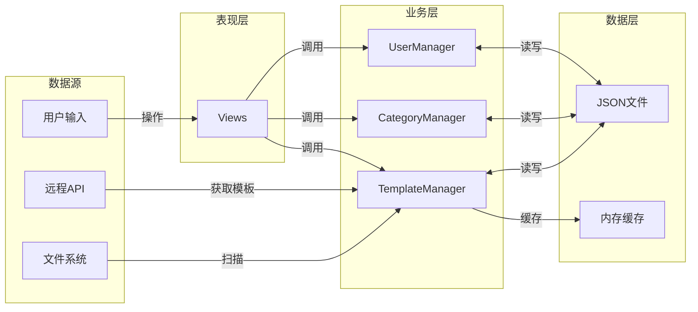

---

## 关键流程数据流

### 1. 应用启动流程

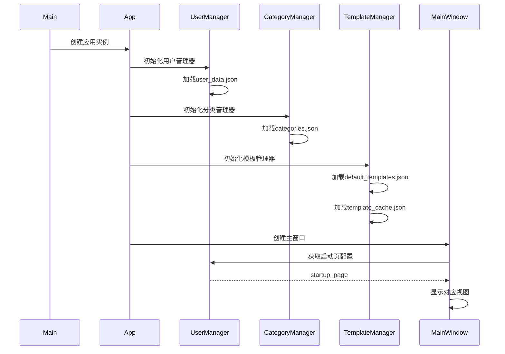

### 2. 智能扫描流程

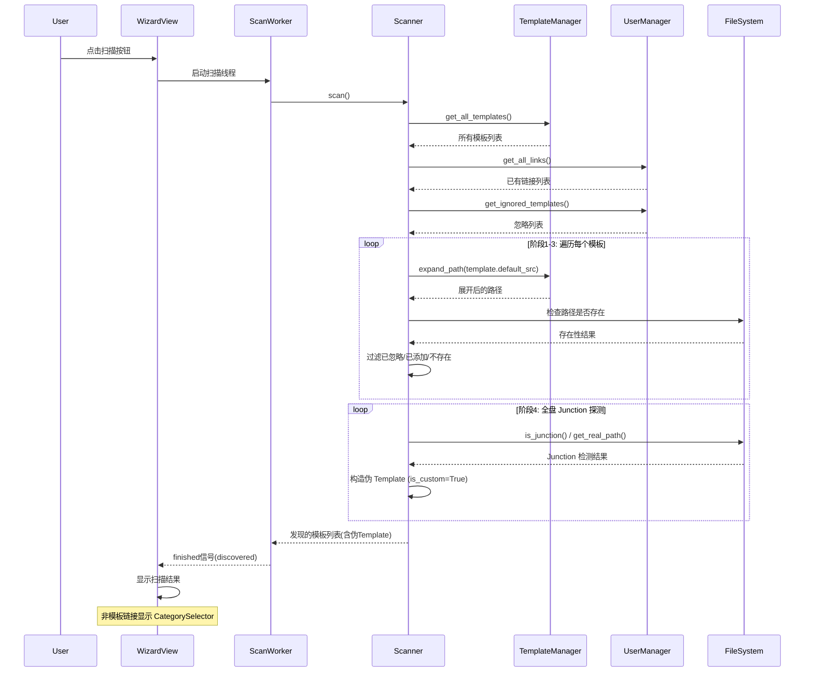

### 3. 导入模板流程

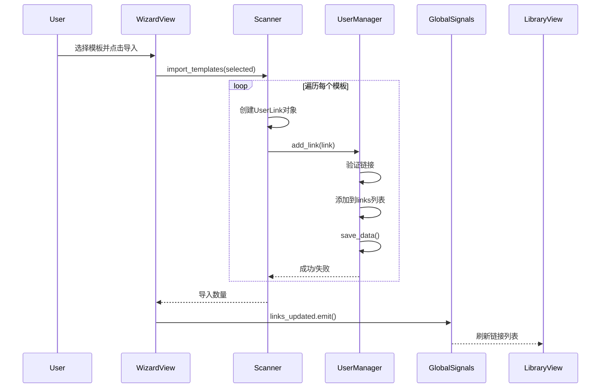

### 4. 分类管理流程

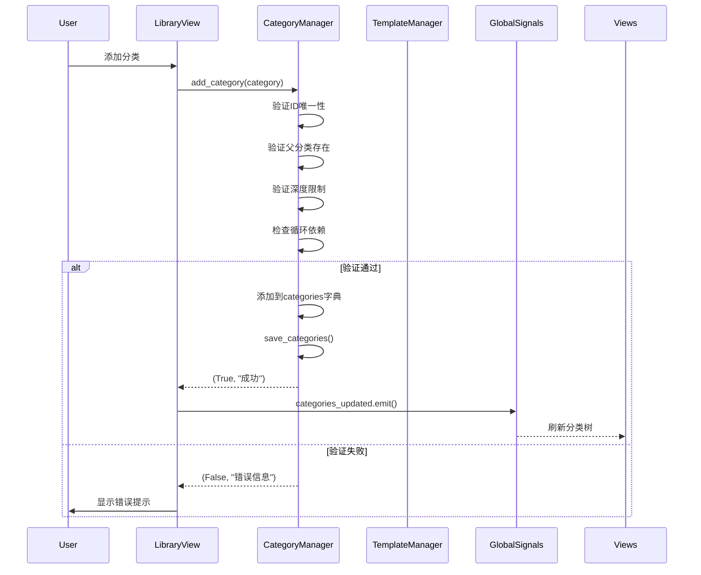

### 5. 模板管理流程

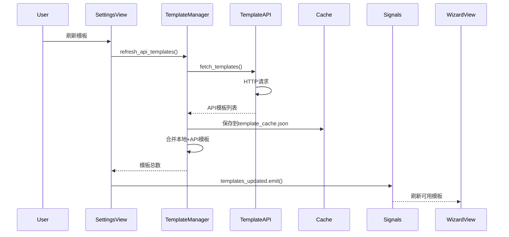

### 6. 主题切换流程

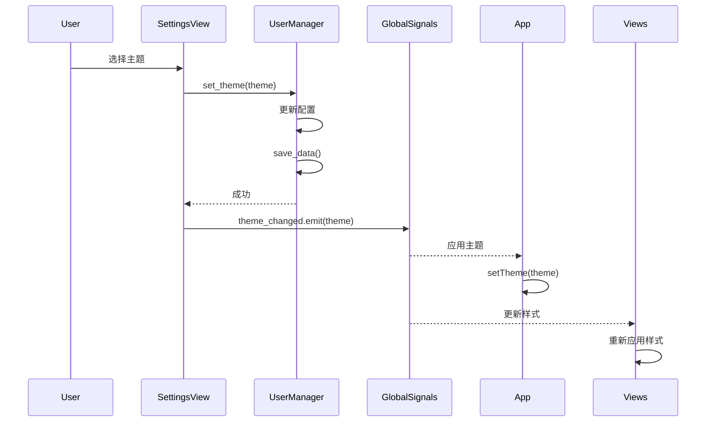

---

## 数据持久化

### 文件结构

```
.ghost-dir/
├── user_data.json          # 用户数据
├── template_cache.json     # API模板缓存
└── logs/                   # 日志文件

config/
├── default_templates.json  # 内置模板
└── categories.json         # 分类配置
```

### 数据格式

#### user_data.json

```json
{
  "links": [
    {
      "id": "uuid",
      "name": "软件名称",
      "source_path": "C:\\源路径",
      "target_path": "D:\\目标路径",
      "category": "category_id",
      "template_id": "template_id",
      "icon": "icon_name"
    }
  ],
  "ignored_templates": ["template_id1", "template_id2"],
  "settings": {
    "theme": "system",
    "theme_color": "#2F6BFF",
    "startup_page": "wizard",
    "target_drive": "D:\\",
    "target_root": "D:\\Ghost_Library"
  }
}
```

#### categories.json

```json
{
  "categories": [
    {
      "id": "dev_tools",
      "name": "开发工具",
      "icon": "Code",
      "parent_id": null,
      "order": 0,
      "depth": 0
    }
  ]
}
```

---

## 数据验证

### 输入验证

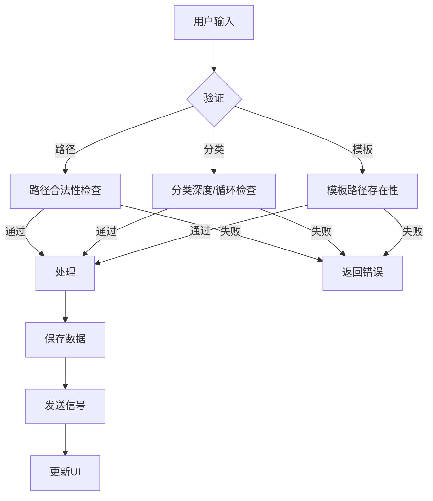

### 验证规则

1. **路径验证**
   - 不在黑名单中
   - 路径格式正确
   - 路径存在(对于源路径)

2. **分类验证**
   - ID唯一性
   - 父分类存在
   - 深度不超过3层
   - 无循环依赖

3. **模板验证**
   - ID唯一性
   - 路径可展开
   - 路径存在

---

## 数据同步

### 信号驱动更新

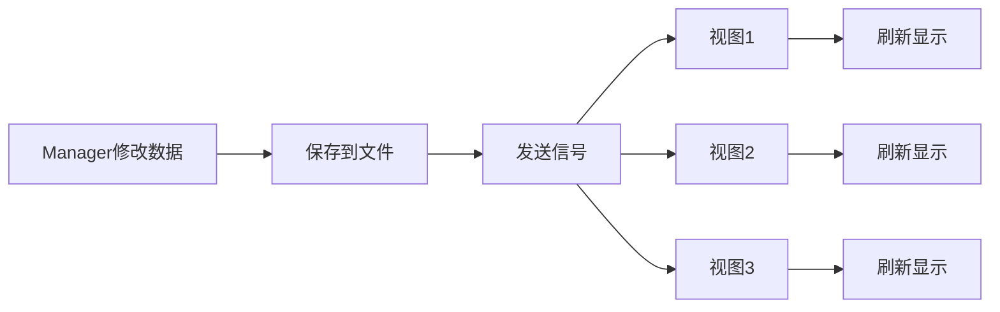

### 全局信号

- `links_updated` - 链接数据变更
- `categories_updated` - 分类数据变更
- `templates_updated` - 模板数据变更
- `theme_changed` - 主题变更
- `theme_color_changed` - 主题色变更

---

## 性能优化

### 1. 缓存策略

- **模板缓存**: API模板缓存到本地,减少网络请求
- **分类树缓存**: 分类树结构缓存,避免重复计算
- **路径展开缓存**: 环境变量展开结果缓存

### 2. 懒加载

- 视图按需创建
- 大列表虚拟滚动
- 图标资源延迟加载

### 3. 批量操作

- 批量导入模板
- 批量更新UI
- 批量保存数据

---

## 错误处理

### 数据加载失败

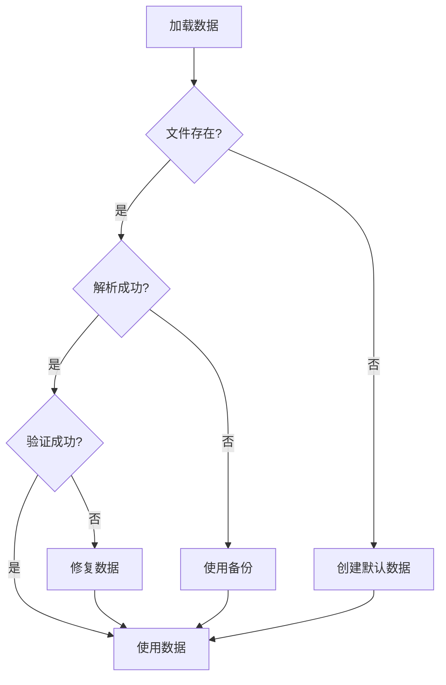

### 数据保存失败

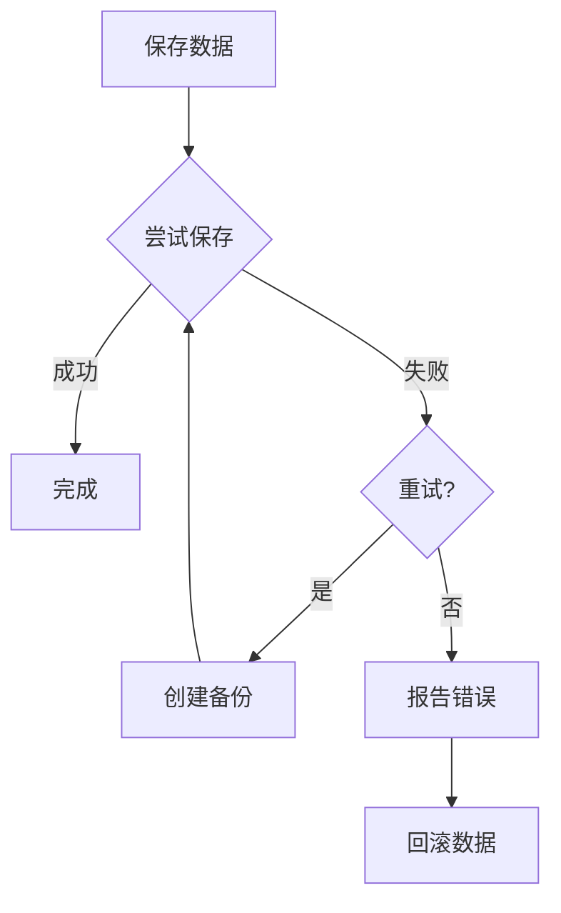

---

## 相关文档

- [系统架构](../overview/system-architecture.md) - 整体架构
- [核心模块](../overview/core-modules.md) - 模块详解
- [组件架构](../overview/component-architecture.md) - GUI组件

---

**最后更新**: 2026-01-28
