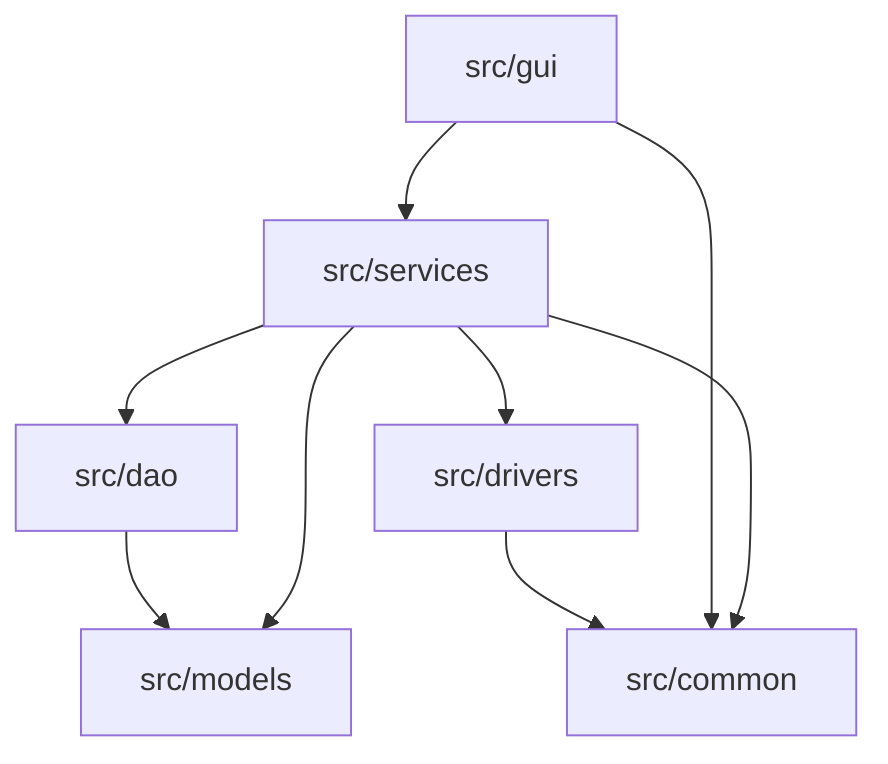

# Ghost-Dir 核心模块详解（当前架构）

- 适用版本: `>=1.0.0`
- 文档状态: `active`
- 最后更新: `2026-02-10`

## 概述

本文档描述当前代码目录下的真实模块边界与职责，基线目录为 `src/`。

## 模块总览



## 1. `src/common` 基础层

职责：
- 全局常量与路径配置（`config.py`）
- 全局信号（`signals.py`）
- 异常定义（`exceptions.py`）
- 兼容层与服务总线（`managers.py`、`service_bus.py`）
- 输入校验器（`validators/`）

约束：
- 不承载 GUI 逻辑。
- 对外提供基础能力，避免与具体业务流程耦合。

## 2. `src/models` 数据模型层

职责：
- 结构化实体定义（如 `Template`、`UserLink`、`CategoryNode`）
- 模型层字段语义统一，供 DAO/Service/UI 共享

约束：
- 不依赖 GUI 与 Service 流程代码。

## 3. `src/dao` 数据访问层

职责：
- 基于 JSON 的持久化读写
- 模型级 CRUD 封装

当前实现：
- `template_dao.py`
- `link_dao.py`
- `category_dao.py`

约束：
- 不包含 UI 交互逻辑。
- 不直接处理系统级副作用（例如 Junction 创建），该类能力属于 Drivers。

## 4. `src/drivers` 系统驱动层

职责：
- 文件系统能力封装（`fs.py`）
- 事务流程封装（`transaction.py`）
- Windows 平台能力封装（`windows.py`）

约束：
- 聚焦原子能力与系统交互，不承载页面流程编排。

## 5. `src/services` 业务服务层

职责：
- 编排业务流程，连接 GUI 与 DAO/Drivers
- 承担业务规则与批处理流程

当前实现：
- `category_service.py`
- `template_service.py`
- `link_service.py`
- `scan_service.py`
- `config_service.py`
- `migration_service.py`
- `occupancy_service.py`

约束：
- 通过依赖注入使用 DAO/Drivers。
- 避免直接访问 GUI 控件对象。

## 6. `src/gui` 表现层

职责：
- 页面、组件、对话框、主窗口、样式与 i18n
- 处理用户交互并调用 Service

当前子目录：
- `windows/`
- `views/`
- `dialogs/`
- `components/`
- `styles/`
- `i18n/`
- `common/`

## 典型调用链

```text
View/Dialog
  -> Service
  -> DAO (读写配置/数据) + Drivers (文件系统/系统能力)
  -> Models
```

## 与历史架构的关系

- 旧目录术语 `src/core`、`src/data`、`src/utils` 已不再是当前主干结构。
- 若在旧文档中看到这些术语，应视为迁移历史或归档内容，不作为当前开发依据。

## 相关文档

- [系统架构](./system-architecture.md)
- [服务层架构](./service-architecture-design.md)
- [组件架构](./component-architecture.md)
- [数据流](../data-flow/data-flow-diagram.md)

**最后更新**: 2026-02-10
