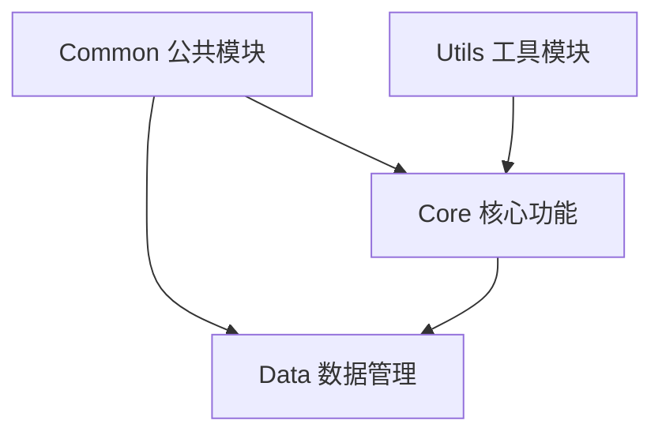
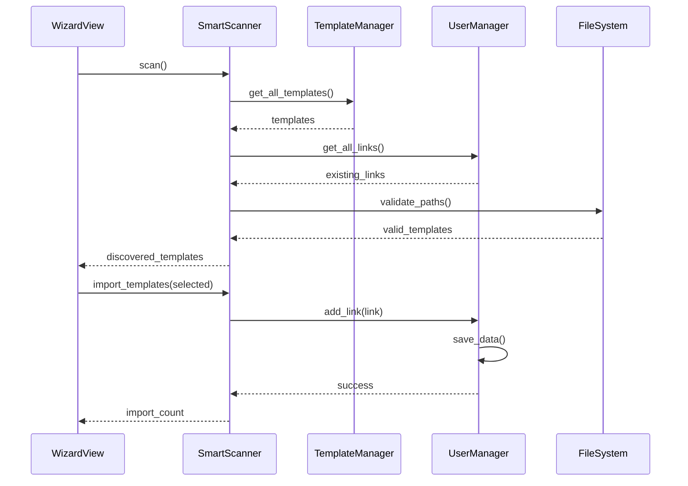
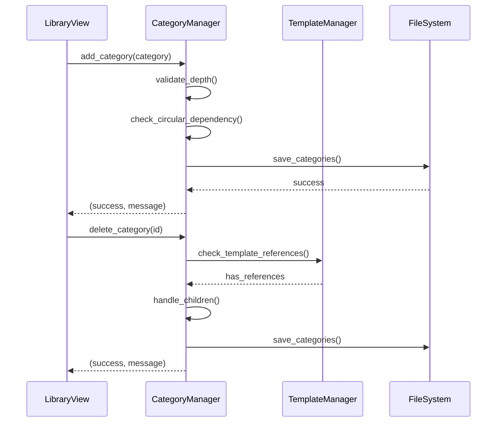

# Ghost-Dir 核心模块详解

## 概述

本文档详细说明 Ghost-Dir 各核心模块的设计、实现和使用方法。

## 模块总览



---

## Common 模块 (基础设施层)

**路径**: `src/common/`

### 模块职责

提供全局配置、资源加载和信号通信等基础设施服务。

### 主要组件

#### 1. config.py - 配置管理

**职责**: 管理应用级配置常量和默认值

**主要配置项**:

```python
# 应用信息
APP_NAME = "Ghost-Dir"
APP_VERSION = "7.4.0"

# 路径配置
DATA_DIR = PROJECT_ROOT / ".ghost-dir"
USER_DATA_FILE = DATA_DIR / "user_data.json"
CATEGORIES_CONFIG = PROJECT_ROOT / "config" / "categories.json"

# 默认设置
DEFAULT_TARGET_DRIVE = "D:\\"
DEFAULT_CATEGORY = "未分类"
DEFAULT_THEME = "system"
DEFAULT_STARTUP_PAGE = "wizard"
```

**配置选项**:
- `THEME_OPTIONS` - 主题模式选项(system/light/dark)
- `THEME_COLOR_OPTIONS` - 主题色选项(9种预设颜色)
- `STARTUP_PAGE_OPTIONS` - 启动页选项(wizard/links/library)

**安全配置**:
- `BLACKLIST_PATHS` - 系统路径黑名单,禁止操作系统关键目录
- `MAX_CATEGORY_DEPTH` - 分类树最大深度限制(3层)
- `SYSTEM_CATEGORIES` - 系统保留分类(不可删除)

**工具函数**:
```python
def format_size(size_bytes: int) -> str:
    """格式化文件大小为人类可读格式"""
```

#### 2. signals.py - 全局信号

**职责**: 定义全局事件信号,实现跨模块通信

**信号定义**:
```python
class GlobalSignals(QObject):
    # 主题相关
    theme_changed = Signal(str)  # 主题切换
    theme_color_changed = Signal(str)  # 主题色切换
    
    # 数据相关
    links_updated = Signal()  # 链接数据更新
    categories_updated = Signal()  # 分类数据更新
    templates_updated = Signal()  # 模板数据更新
```

**使用场景**:
- 主题切换时通知所有UI组件更新
- 数据变更时通知相关视图刷新
- 跨模块事件通知

#### 3. resource_loader.py - 资源加载

**职责**: 加载应用资源(图标、图片等)

**主要功能**:
- 加载图标资源
- 管理资源路径
- 资源缓存(规划中)

---

## Core 模块 (核心功能层)

**路径**: `src/core/`

### 模块职责

实现文件扫描、链接优化、安全检查和事务管理等核心功能。

### 主要组件

#### 1. scanner.py - 智能扫描器

**类**: `SmartScanner`

**职责**: 自动发现本机可管理的软件

**初始化**:
```python
scanner = SmartScanner(template_manager, user_manager)
```

**主要方法**:

```python
def scan() -> List[Template]:
    """
    扫描本机,发现可管理的软件
    
    过滤规则:
    1. 已忽略的模板
    2. 已手动添加的模板
    3. 路径不存在的模板
    4. 已被管理的路径
    
    Returns:
        发现的模板列表
    """

def import_templates(templates: List[Template], target_drive: str = "D:\\") -> int:
    """
    批量导入模板为用户链接
    
    Args:
        templates: 要导入的模板列表
        target_drive: 目标驱动器
        
    Returns:
        成功导入的数量
    """
```

**工作流程**:
1. 获取所有模板
2. 过滤已忽略和已添加的模板
3. 验证路径存在性
4. 返回可导入的模板列表

#### 2. link_opt.py - 链接优化器

**职责**: 优化符号链接,提高性能

**主要功能**:
- 链接路径优化
- 链接有效性检查
- 链接修复建议

#### 3. safety.py - 安全检查器

**职责**: 验证操作的安全性

**检查项**:
- 路径黑名单检查
- 权限验证
- 路径合法性检查
- 循环依赖检测

**使用示例**:
```python
# 检查路径是否安全
if not is_safe_path(path):
    raise SecurityError("路径在黑名单中")
```

#### 4. transaction.py - 事务管理器

**职责**: 确保文件操作的原子性

**主要功能**:
- 事务开始/提交/回滚
- 操作日志记录
- 失败自动回滚

**使用模式**:
```python
with Transaction() as tx:
    tx.add_operation(create_link, args)
    tx.add_operation(update_config, args)
    # 自动提交或回滚
```

---

## Data 模块 (业务逻辑层)

**路径**: `src/data/`

### 模块职责

管理业务数据和业务逻辑,包括分类、模板和用户数据。

### 主要组件

#### 1. model.py - 数据模型

**职责**: 定义核心数据结构

**主要模型**:

```python
@dataclass
class CategoryNode:
    """分类节点"""
    id: str
    name: str
    icon: str
    parent_id: Optional[str]
    order: int
    depth: int

@dataclass
class Template:
    """模板"""
    id: str
    name: str
    default_src: str
    category: str
    icon: str
    description: str

@dataclass
class UserLink:
    """用户链接"""
    id: str
    name: str
    source_path: str
    target_path: str
    category: str
    template_id: Optional[str]
    icon: str
```

#### 2. category_manager.py - 分类管理器

**类**: `CategoryManager`

**职责**: 管理分类树结构,支持多层级分类

**主要方法**:

```python
def get_all_categories() -> List[CategoryNode]:
    """获取所有分类"""

def get_children(parent_id: Optional[str] = None) -> List[CategoryNode]:
    """获取子分类,按order排序"""

def add_category(category: CategoryNode) -> Tuple[bool, str]:
    """
    添加分类
    
    验证:
    - ID唯一性
    - 父分类存在性
    - 深度限制(最多3层)
    - 循环依赖检测
    """

def update_category(category: CategoryNode) -> Tuple[bool, str]:
    """更新分类,验证系统分类保护"""

def delete_category(category_id: str) -> Tuple[bool, str]:
    """
    删除分类
    
    检查:
    - 系统分类保护
    - 子分类处理
    - 模板引用检查
    """

def can_add_child_category(parent_id: str) -> Tuple[bool, str]:
    """验证是否可以添加子分类(深度限制)"""
```

**特性**:
- 支持3层分类树
- 系统分类保护(uncategorized不可删除)
- 循环依赖检测
- 冲突处理策略(skip/overwrite/rename)

#### 3. template_manager.py - 模板管理器

**类**: `TemplateManager`

**职责**: 管理软件模板,支持本地和API模板

**主要方法**:

```python
def get_all_templates() -> List[Template]:
    """获取所有模板(本地+API)"""

def add_template(template: Template) -> bool:
    """添加自定义模板"""

def update_template(template: Template) -> bool:
    """更新模板"""

def delete_template(template_id: str) -> bool:
    """删除模板"""

def validate_template_path(template: Template) -> bool:
    """验证模板路径是否存在"""

def expand_path(path: str) -> str:
    """展开环境变量"""
```

**模板来源**:
1. **内置模板**: `config/default_templates.json`
2. **API模板**: 从远程API获取并缓存
3. **自定义模板**: 用户手动添加

#### 4. template_api.py - 模板API

**职责**: 从远程API获取模板

**主要功能**:
- 获取最新模板列表
- 缓存API响应
- 错误处理和重试

#### 5. user_manager.py - 用户管理器

**类**: `UserManager`

**职责**: 管理用户数据和配置

**主要方法**:

```python
def get_all_links() -> List[UserLink]:
    """获取所有用户链接"""

def add_link(link: UserLink) -> bool:
    """添加链接"""

def update_link(link: UserLink) -> bool:
    """更新链接"""

def delete_link(link_id: str) -> bool:
    """删除链接"""

def is_ignored(template_id: str) -> bool:
    """检查模板是否被忽略"""

def add_ignored_template(template_id: str):
    """添加到忽略列表"""

def has_link_for_template(template_id: str) -> bool:
    """检查是否已有该模板的链接"""
```

**数据管理**:
- 用户链接列表
- 忽略的模板列表
- 用户配置(主题、启动页等)
- 数据持久化到JSON文件

---

## Utils 模块 (工具层)

**路径**: `src/utils/`

### 模块职责

提供平台相关的工具函数。

### 主要组件

#### 1. admin.py - 管理员权限

**职责**: 处理管理员权限相关操作

**主要功能**:
- 检查管理员权限
- 请求权限提升
- UAC处理(Windows)

#### 2. space_analyzer.py - 空间分析

**职责**: 分析磁盘空间使用情况

**主要功能**:
- 计算目录大小
- 磁盘空间统计
- 空间占用分析

#### 3. win_utils.py - Windows工具

**职责**: Windows平台特定功能

**主要功能**:
- 符号链接创建
- 文件属性操作
- 系统API调用

---

## 模块间交互

### 典型流程示例

#### 1. 扫描并导入软件



#### 2. 分类管理



---

## 设计模式应用

### 1. 单例模式

**应用**: 全局信号对象

```python
# signals.py
global_signals = GlobalSignals()  # 全局单例
```

### 2. 管理器模式

**应用**: 各种Manager类

- `CategoryManager` - 分类管理
- `TemplateManager` - 模板管理
- `UserManager` - 用户数据管理

### 3. 数据类模式

**应用**: 数据模型定义

```python
@dataclass
class CategoryNode:
    id: str
    name: str
    # ...
```

### 4. 策略模式

**应用**: 冲突处理策略

```python
def add_category_with_conflict(
    category: CategoryNode,
    conflict_strategy: str = "skip"  # skip/overwrite/rename
):
    # 根据策略处理冲突
```

---

## 最佳实践

### 1. 模块使用

```python
# 推荐: 明确导入
from src.data.category_manager import CategoryManager
from src.core.scanner import SmartScanner

# 避免: 通配符导入
from src.data import *  # ❌
```

### 2. 错误处理

```python
# 推荐: 返回元组表示成功/失败
def add_category(category) -> Tuple[bool, str]:
    if not valid:
        return False, "错误信息"
    return True, "成功"

# 使用时
success, message = manager.add_category(cat)
if not success:
    show_error(message)
```

### 3. 数据验证

```python
# 推荐: 在Manager层进行验证
def add_category(self, category):
    # 验证深度
    if category.depth > MAX_CATEGORY_DEPTH:
        return False, "超过最大深度"
    
    # 验证循环依赖
    if self._has_circular_dependency(...):
        return False, "循环依赖"
    
    # 执行操作
    self.categories[category.id] = category
    return True, "成功"
```

---

## 相关文档

- [系统架构](./system-architecture.md) - 整体架构说明
- [组件架构](./component-architecture.md) - GUI组件设计
- [数据流](../data-flow/data-flow-diagram.md) - 数据流转
- [设计模式](../design-patterns/patterns-used.md) - 设计模式应用

---

**最后更新**: 2026-01-28
