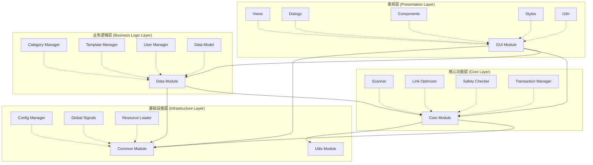
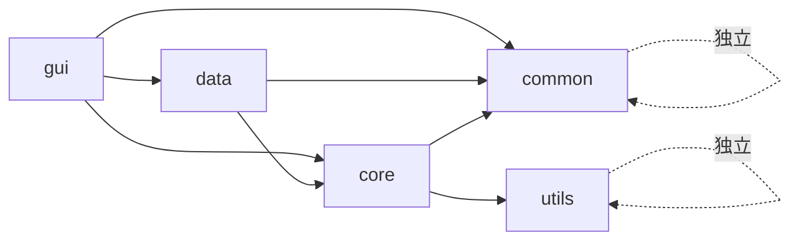
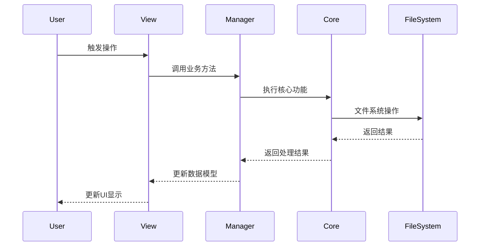

# Ghost-Dir 系统架构

## 概述

Ghost-Dir 是一个基于 PySide6 的桌面应用程序,采用分层架构设计,实现了文件管理、模板系统和用户界面的清晰分离。

## 系统架构图

## 架构分层

### 1. 表现层 (Presentation Layer)

**模块**: `src/gui/`

**职责**:
- 用户界面展示
- 用户交互处理
- 视图状态管理
- 样式和主题管理
- 国际化支持

**主要组件**:
- `app.py` - 应用主类,管理应用生命周期
- `views/` - 功能视图页面(console, help, library, settings, wizard)
- `dialogs/` - 对话框组件
- `components/` - 可复用UI组件
- `windows/` - 主窗口和子窗口
- `styles/` - 样式系统和主题
- `i18n/` - 国际化和本地化

### 2. 业务逻辑层 (Business Logic Layer)

**模块**: `src/data/`

**职责**:
- 业务规则实现
- 数据管理和持久化
- 业务对象模型
- 业务流程编排

**主要组件**:
- `model.py` - 数据模型定义(Category, Template, Link等)
- `category_manager.py` - 分类管理器,处理分类CRUD
- `template_manager.py` - 模板管理器,处理模板CRUD
- `template_api.py` - 模板API接口
- `user_manager.py` - 用户数据管理

### 3. 核心功能层 (Core Layer)

**模块**: `src/core/`

**职责**:
- 核心算法实现
- 文件系统操作
- 链接优化逻辑
- 安全检查机制
- 事务管理

**主要组件**:
- `scanner.py` - 文件扫描器,扫描目录和文件
- `link_opt.py` - 链接优化器,优化符号链接
- `safety.py` - 安全检查器,验证操作安全性
- `transaction.py` - 事务管理器,确保操作原子性

### 4. 基础设施层 (Infrastructure Layer)

**模块**: `src/common/` 和 `src/utils/`

**职责**:
- 配置管理
- 资源加载
- 全局信号
- 工具函数
- 平台相关功能

**主要组件**:
- `common/config.py` - 配置管理器,管理应用配置
- `common/signals.py` - 全局信号定义
- `common/resource_loader.py` - 资源加载器
- `utils/admin.py` - 管理员权限工具
- `utils/space_analyzer.py` - 磁盘空间分析
- `utils/win_utils.py` - Windows平台工具

## 技术栈

### 核心框架
- **PySide6** - Qt for Python,GUI框架
- **Python 3.8+** - 编程语言

### UI组件库
- **qfluentwidgets** - Fluent Design风格组件库

### 数据存储
- **JSON** - 配置和数据持久化
- **文件系统** - 模板和用户数据存储

### 开发工具
- **Git** - 版本控制
- **pytest** - 单元测试(规划中)

## 架构设计原则

### 1. 分层架构 (Layered Architecture)

- **单向依赖**: 上层依赖下层,下层不依赖上层
- **职责分离**: 每层有明确的职责边界
- **接口隔离**: 层间通过清晰的接口通信

### 2. 模块化设计 (Modular Design)

- **高内聚**: 模块内部功能紧密相关
- **低耦合**: 模块间依赖最小化
- **可替换**: 模块可独立替换和升级

### 3. 组件化 (Component-Based)

- **可复用**: 组件可在多处使用
- **独立性**: 每个组件职责单一
- **组合性**: 复杂功能通过组件组合实现

详见: [组件架构文档](./component-architecture.md)

### 4. 信号驱动 (Event-Driven)

- **解耦通信**: 使用Qt信号槽机制解耦组件
- **异步处理**: 长时间操作使用工作线程
- **响应式**: UI及时响应用户操作

### 5. 配置驱动 (Configuration-Driven)

- **外部配置**: 关键参数通过配置文件管理
- **灵活调整**: 无需修改代码即可调整行为
- **环境隔离**: 支持不同环境的配置

## 模块依赖关系

**依赖规则**:
1. GUI层可以使用Data、Core、Common
2. Data层可以使用Core、Common
3. Core层可以使用Common、Utils
4. Common和Utils层相互独立,不依赖其他层

## 数据流概览

详见: [数据流文档](../data-flow/data-flow-diagram.md)

## 关键设计决策

### 1. 为什么使用PySide6而非PyQt6?

- **许可证**: PySide6使用LGPL,更适合商业应用
- **官方支持**: Qt官方维护,更新及时
- **社区活跃**: 文档完善,社区支持好

### 2. 为什么采用分层架构?

- **可维护性**: 清晰的层次便于理解和维护
- **可测试性**: 每层可独立测试
- **可扩展性**: 新功能可在合适的层添加

### 3. 为什么使用JSON而非数据库?

- **轻量级**: 无需额外的数据库依赖
- **可读性**: 配置文件易于查看和编辑
- **便携性**: 数据文件可直接复制迁移
- **适用性**: 数据量小,JSON足够满足需求

### 4. 为什么使用信号槽机制?

- **解耦**: 组件间无需直接引用
- **灵活**: 一对多通信简单实现
- **线程安全**: Qt自动处理跨线程信号

## 性能考虑

### 1. 异步操作

- 文件扫描使用`QThread`避免UI冻结
- 大量数据处理使用工作线程
- 进度反馈通过信号实时更新

### 2. 资源管理

- 延迟加载: 按需加载资源和组件
- 缓存机制: 缓存常用数据和计算结果
- 及时释放: 不再使用的资源及时清理

### 3. UI优化

- 虚拟滚动: 大列表使用虚拟化技术
- 防抖节流: 频繁操作使用防抖/节流
- 批量更新: 批量DOM更新减少重绘

## 安全考虑

### 1. 文件操作安全

- 路径验证: 检查路径合法性
- 权限检查: 验证操作权限
- 事务保护: 关键操作使用事务

### 2. 数据验证

- 输入验证: 验证用户输入
- 类型检查: 使用类型注解
- 边界检查: 检查数组越界等

### 3. 错误处理

- 异常捕获: 捕获并处理异常
- 错误日志: 记录错误信息
- 用户提示: 友好的错误提示

## 扩展性设计

### 1. 插件机制 (规划中)

- 支持第三方插件
- 插件独立加载和卸载
- 插件API标准化

### 2. 主题系统

- 支持自定义主题
- 动态切换主题
- 主题配置外部化

### 3. 国际化

- 多语言支持
- 语言包独立管理
- 运行时切换语言

## 相关文档

- [组件架构文档](./component-architecture.md) - GUI组件化设计
- [核心模块文档](./core-modules.md) - 各模块详细说明
- [数据流文档](../data-flow/data-flow-diagram.md) - 数据流转说明
- [设计模式文档](../design-patterns/patterns-used.md) - 设计模式应用

---

**最后更新**: 2026-01-28
