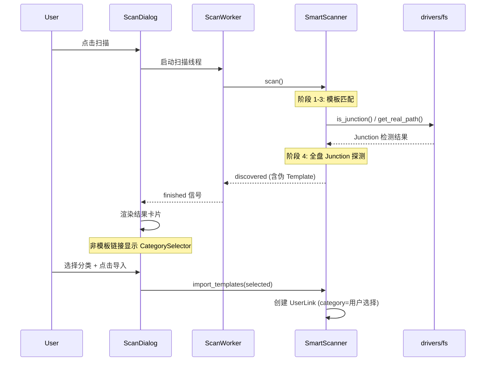

# 全盘 Junction 扫描特性

- 适用版本: `>=1.0.1`
- 文档状态: `active`
- 最后更新: `2026-02-26`

> **状态**: 已实现  
> **创建日期**: 2026-02-26  
> **负责模块**: 扫描服务 (Scan Service)、链接视图 (Links View)

---

## 1. 需求概述

原有扫描功能仅基于预定义模板匹配本地已安装软件路径。本特性扩展 `SmartScanner` 的探测范围，**主动发现磁盘上所有已存在的 Junction/Symlink 目录链接**，将它们纳入管理。

非模板来源的链接没有预设分类，在扫描结果卡片上提供分类下拉选择器，默认"未分类"。

---

## 2. 架构设计

### 2.1 扫描服务层

**文件**: `src/services/scan_service.py`

在 `SmartScanner.scan()` 的三级探测机制之后，新增**第四阶段：全盘 Junction 探测**。

#### 探测策略

```
阶段 1-3: 模板匹配（默认路径 → 注册表 → 磁盘关键词）
    ↓
阶段 4: 全盘 Junction/Symlink 探测
    ↓
合并去重 → 返回 discovered 列表
```

#### 新增方法

| 方法 | 职责 |
|------|------|
| `_scan_disk_junctions(exclude_srcs)` | 遍历所有逻辑磁盘的 1-2 级目录，检测 Junction |
| `_junction_to_template(path, exclude_srcs)` | 将 Junction 路径转换为伪 Template 对象 |

#### 探测范围

- **磁盘**: 所有逻辑磁盘 `C:` ~ `Z:`
- **深度**: 最大 2 级（磁盘根目录 + 一级子目录下的子项）
- **排除**: 系统保护路径（`Windows`、`ProgramData`、`$Recycle.Bin` 等）

#### 伪 Template 构造

```python
Template(
    id=f"junction_{uuid4_hex[:8]}",
    name=dir_name,           # 目录名
    default_src=junction_path,
    default_target=real_target,  # 链接指向的物理路径
    category_id=None,        # 无分类
    is_custom=True           # 标记为非模板来源
)
```

### 2.2 UI 层

#### ScanResultCard

**文件**: `src/gui/views/wizard/widgets/scan_result_card.py`

- `category_id` 非 `None` → 静态分类标签（模板链接，保持原有行为）
- `category_id` 为 `None` → `CategorySelector` 下拉选择器（非模板链接）
- `get_template()` 返回前自动将用户选择的分类同步到 Template 对象

#### ScanFlowDialog

**文件**: `src/gui/dialogs/scan_wizard/scan_flow_dialog.py`

- 创建卡片时传入 `category_manager`，驱动分类选择器

---

## 3. 数据流



---

## 4. 依赖关系

```
GUI (ScanFlowDialog, ScanResultCard)
  → Services (SmartScanner)
  → Drivers (fs.is_junction, fs.get_real_path)
  → Models (Template, UserLink)
```

符合五层金字塔架构的单向依赖原则。

---

## 5. 设计决策

| 决策 | 选择 | 理由 |
|------|------|------|
| 扫描深度 | 最大 2 级 | 平衡覆盖率与性能，避免深度递归 |
| 系统路径排除 | 硬编码白名单排除 | 简单可靠，避免误扫 Windows 系统链接 |
| 分类默认值 | `None`（未分类） | 用户不选择也不阻塞导入 |
| 伪 Template 标记 | `is_custom=True` | 与正式模板区分，便于后续扩展 |

---

## 6. 涉及文件

| 文件 | 变更类型 | 说明 |
|------|---------|------|
| `src/services/scan_service.py` | MODIFY | 新增全盘 Junction 探测阶段 |
| `src/gui/views/wizard/widgets/scan_result_card.py` | MODIFY | 非模板链接显示分类选择器 |
| `src/gui/dialogs/scan_wizard/scan_flow_dialog.py` | MODIFY | 传入 category_manager |

---

## 7. 参考资料

- [Service 层架构设计](../../architecture/overview/service-architecture-design.md)
- [数据流图](../../architecture/data-flow/data-flow-diagram.md)
- [数据迁移功能文档](../data-migration-feature.md)

---

**最后更新**: 2026-02-26
